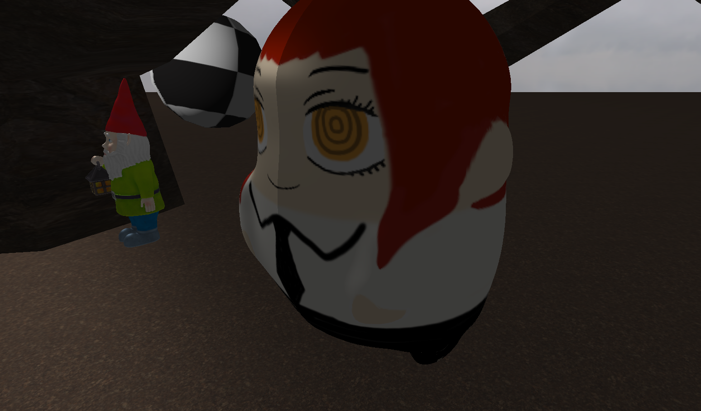
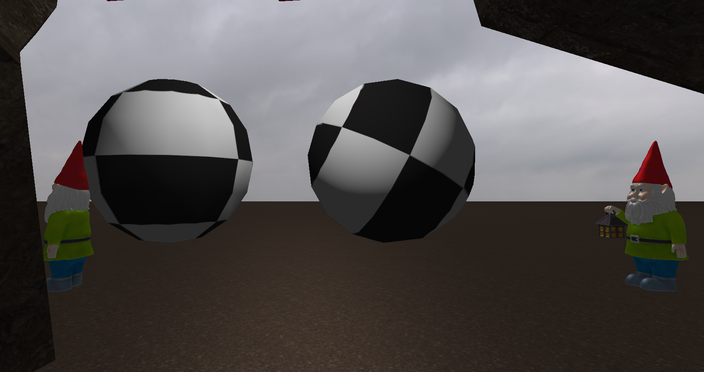

# :heart: Makima Plushie Simulator :heart:
Repo for our project :heart:

## How to run
### Windows
If you have windows you must have openGL installed and compile it
Using whatever you like, we suggest the use of [Code Blocks](https://www.codeblocks.org)

### Linux
In case you are using Linux (Debian Based) you must run the following commands
before compiling the game

` sudo apt-get install build-essential make libx11-dev libxrandr-dev \
                         libxinerama-dev libxcursor-dev libxcb1-dev libxext-dev \
                         libxrender-dev libxfixes-dev libxau-dev libxdmcp-dev \
                         libmesa-dev libxxf86vm-dev `

and now install OpenGL with

`sudo apt install freeglut3-dev`

then you can just run the game with

`make run`

## Images

This game was inspired by our goddess

1st screenshot of the game

2nd screenshot of the game

## Makima Plushie Simulator Manual (MAKIMA SMASH):
### Interactions:

W, S, A, D: Used for character (camera) movement.
E: SMASH. (attack mode + DEATH TOUCH)
1: Enable/Disable the crosshair.
V: Switch between camera look-at and free-view.
P, O: Switch between the projections (a legacy from the lab, and it glitches the skysphere).

## Game:
The objective of the game is to CRUSH the gnomes. Accompanied by an ABSURD environment. And with some friendly little balls.
